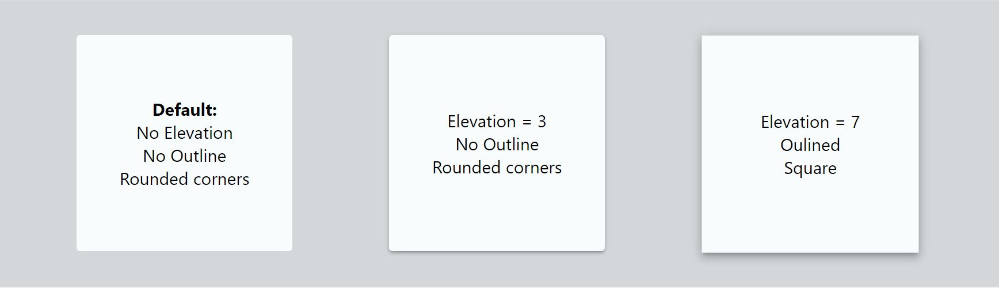

# @ramonak/paper

> React Paper Component

[](https://www.npmjs.com/package/@ramonak/paper) [](https://standardjs.com)

---



---

[Playground / Code Generator](https://katerinalupacheva.github.io/paper-component/)

---

## Install

```bash
npm install --save @ramonak/paper
```

## Usage

```jsx
import React from 'react'

import Paper from '@ramonak/paper'
import '@ramonak/paper/dist/index.css'

const Example = () => {
    return <Paper elevation={3}/>
};
```

## Props

| Name | Type | Default | Description |
| ---- | ---- | ------- | ----------- |
| `elevation` | `Number between 0 and` <br/>` 24` |  | Shadow depth. |
| `oulined` | `boolean` | false | Outlined surface. |
| `square` | `boolean` | false | If *true*, no rounded corners. |
| `customClass` | `string` |  | Name of the css custom class to add custom styles. |

## License

MIT © [KaterinaLupacheva](https://github.com/KaterinaLupacheva)
